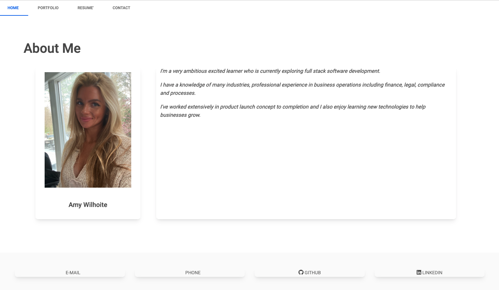

# react-portfolio
Here's my professional portfolio or work, created with react!

## Description
This is a front end application using react to display my portfolio of work through this bootcamp. This app uses React, jsx, css, and mdb react and features projects in:
* Web-APIs
* Third-Party-APIs
* NodeJS
* OOP
* Express
* SQL (MySQL)
* ORM
* Mongo (NOSQL)
* React

## Preview
*  

## Links
* GitHub Page: https://amywilhoite.github.io/react-portfolio/
* Repository: https://github.com/AmyWilhoite/react-portfolio.git

